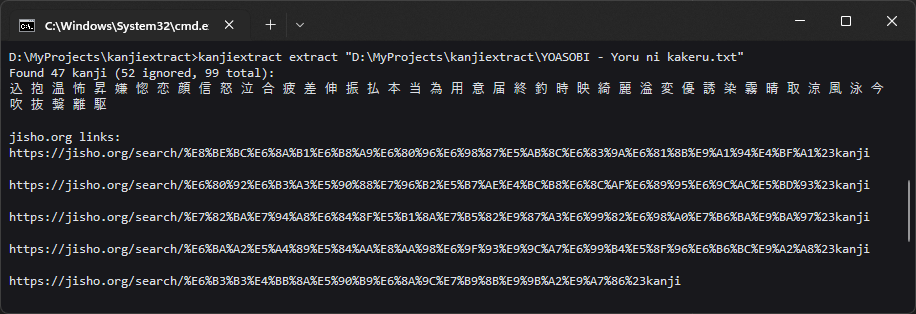

# kanjiextract

The script was created to simplify the study of the Japanese language by breaking down texts.

As input, it receives the path to a text file, finds all the kanji in it, and prints the jisho.org links for all the kanji to the console. It also has an ignore list feature to skip already known kanji.

# Installation

1. Clone the repository
2. Run `pip install .` in it

# Usage
| Command                                        | Description                                                                                                                                       |
|------------------------------------------------|---------------------------------------------------------------------------------------------------------------------------------------------------|
 | `kanjiextract extract <path>`                  | Find all kanji in the text file and print kanji and jisho.org links                                                                               |
 | `kanjiextract ignore add <kanji>`              | Add one or multiple kanji to the ignore list                                                                                                      |
| `kanjiextract ignore add --file <path>`        | Find all kanji in file and add to the ignore list                                                                                                 |
| `kanjiextract ignore remove <kanji>`           | Remove one or multiple kanji from the ignore list                                                                                                 |
| `kanjiextract ignore remove --file <path>`     | Remove from the ignore list all kanji found in the file                                                                                           |
| `kanjiextract ignore list [--no_spaces]`       | Print the kanji contained in the ignore list                                                                                                      |
| `kanjiextract ignore set <kanji>`              | Overwrite the ignore list with new contents                                                                                                       |
| `kanjiextract ignore set --file <path>`        | Overwrite the ignore list with contents of the file                                                                                               |
| `kanjiextract ignore file set <path> [--move]` | Set custom location for ignore list file (`--move` - move the contents of internal storage to new file). Empty path - use internal storage again. |
| `kanjiextract ignore file path`                | Print the path of the custom ignore list file (if used)                                                                                           |
